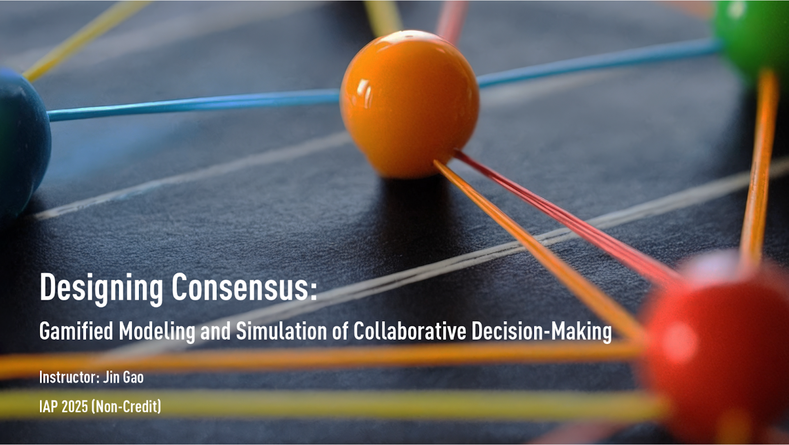

# Designing Consensus: Gamified Modeling and Simulation of Collaborative Decision-Making

## MIT IAP 2025 Non-Credit Subject

## Introduction

Design is a process of reaching a consensus. Stakeholders often face conflicting interests and values among diverse options. In this seminar-workshop formatted night course, we will explore methods for modeling, simulating, and analyzing collaborative decision-making in conceptual or real-world design challenges and beyond.

We start each session with a 1-hour seminar introducing concepts and methods. Then we will begin a workshop to turn your favorite design case into a game, individually or in groups.

We learn together! You are encouraged to bring your own case studies and perspectives on any design topic. We will focus on leveraging your designer mindset with beginner-friendly technical topics, not jargon, so no prior technical experience is required.

## Instructor
Jin Gao (SMArchS Urbanism & SM EECS Candidate)

### Time & Location
**Tuesdays and Thursdays, Jan 16 - 30, 6-8 PM**  

---

## Calendar

| Date    | Topic                                      | Contents |
|---------|--------------------------------------------|----------|
| **Jan 16**  | **Design as a Game** | Overview and introduction of core concepts. Introduce classical physical board games and their mechanisms, including Monopoly, Tiny Towns, and Small City. **Workshop:** Brainstorming and conceptualization. |
| **Jan 21**  | **Modeling and Collaborative Decision-Making** | Further introduction to game theory and decision-making from a computational perspective. Explore how we can turn a game (like Go) into a format the computer can recognize, play, and learn with. Introduction to traditional decision-making modeling approaches. **Workshop:** Group formation, mockups, playtesting, and refinement of your conceptual board game. 🎉 Free food will be provided to celebrate my birthday! |
| **Jan 23**  | **System Dynamics and Simulation Games (SLG)** | Introduction to system dynamics as an approach for modeling complex systems. Introduction to SLGs like SimCity. **Workshop:** Sketch out system dynamics loops and diagrams of your game. Playtest and refine. |
| **Jan 28**  | **Swarm Intelligence and Emergent Intelligence** | Introduction to agent-based approaches, swarm intelligence, and emergent intelligence. Discussion on modern simulation games like Cities: Skylines. **Workshop:** Experiment with GAMA to simulate pedestrian behavior. Prepare for presentation. |
| **Jan 30**  | **Multi-Agent Learning** | Exploring multi-agent learning and reinforcement learning for decision-making in environments we create. Overview of advances including Deep Blue, AlphaGo, and Cicero. **Workshop:** Present final game design, discuss strategies and balancing. Wrap up. |

For any questions, please reach out via email at [gaojin@mit.edu](mailto:gaojin@mit.edu).
